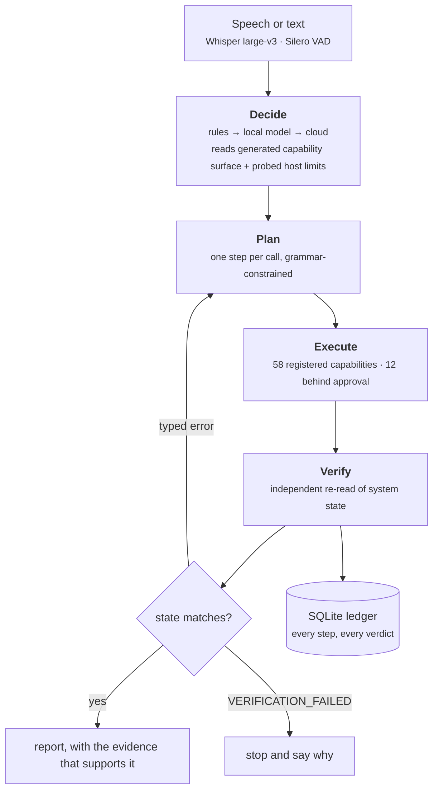
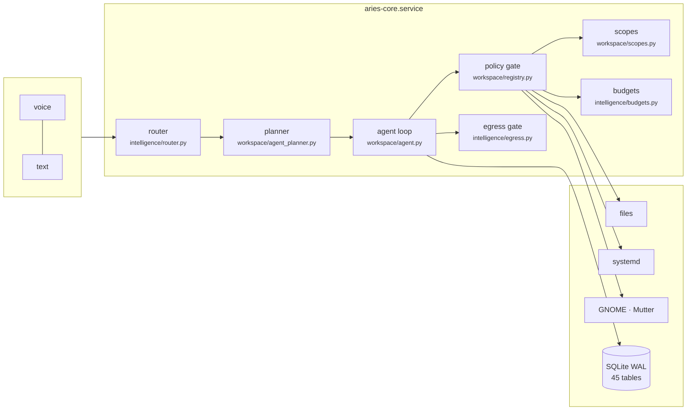

# ARIES

A voice-driven assistant that acts on a live Ubuntu/GNOME desktop, built around one question:

> **What may an agent claim about itself?**

An agent that acts on a real machine makes two claims — *"I can do this"* before acting, and
*"I did this"* after acting. This project grounds both in machine-readable facts rather than in
the model's own confidence or the executor's own report, and measures what that is worth.

Everything below carries its denominator. Where a number is missing, that is said rather than
filled in.

---

## What it does

Speech or text in, real action out: files, systemd units, windows and workspaces, media sinks,
read-only network state, synthesised keyboard and pointer input. Local-first — a local LLM
decides and plans; a cloud provider is opt-in and gated.

It is not a chat model with tools attached. Three properties exist specifically to make it
measurable:

**A closed capability registry.** 58 capabilities, each declaring an argument schema, an
executor, a verifier and an effect class. A model cannot act outside that set, and the refusal
is an observable event rather than an inference.

**Verification as a separate stage.** After a step runs, state is re-read through a path that
does not go through the executor. For a service restart the executor calls `systemctl` and reads
its exit status; the verifier compares the unit's `InvocationID` before and after. A call that
exits zero without restarting anything does not change it.

**Typed errors that decide what happens next.** `TARGET_NOT_FOUND` and `CAPABILITY_UNAVAILABLE`
route to a declared alternative; `VERIFICATION_FAILED` stops. Budgets are hard: at most 4
capability invocations per sub-goal, 2 repeats of one strategy, 2 distinct alternatives.



---

## Results

All figures from a frozen snapshot, `2026-10-06T12:38Z`, commit `f9b500d`. Every one is
extracted from a raw artifact by script; none is transcribed.

### The main experiment: what grounds the decision to act

Four additive arms over 225 out-of-distribution utterances (100 actionable, 40 out-of-scope).
Same model (`qwen2.5:7b`, confidence threshold 0.82), same fixture; only the prompt components
change.

| arm | accuracy | out-of-scope refused | refusal precision | real requests wrongly refused |
|---|---|---|---|---|
| A0 baseline, no refusal vocabulary | 119/225 | 0/40 | never refuses | 0/100 |
| A1 + `ASK` / `OUT_OF_SCOPE` | 153/225 | 15/40 | 44/53 | **9/100** |
| A2 + generated capability surface | 157/225 | 17/40 | 38/40 | 2/100 |
| A3 + probed machine limits | **161/225** | **21/40** | **47/48** | **1/100** |

Accuracy is the wrong headline. A1 is a configuration nobody should ship: it blocks 9 of every
100 real requests. The finding is in the last two columns — grounding raises precision *and*
refuses **more** out-of-scope requests, not fewer. A shifted threshold trades one for the other;
precision and recall improving together is the signature of a better signal.

Three things that keep this honest:

- **47/48 is refusal precision**, not system accuracy. In the same arm only 21 of 40 out-of-scope
  requests were caught.
- A trivial system that refuses everything scores **125/225**. Every accuracy figure must be read
  against that.
- Model confidence alone separates the two populations at **AUC 0.725** on the English fixture.
  It carries information; it does not yield a usable threshold. Without refusal words in the
  intent vocabulary the router refused **0 of 229** utterances — not from certainty, but from
  having no way to say no.

### What "verified" actually means

All 58 verifiers were classified, 57 of them with executed proof.

| class | n | what it does |
|---|---|---|
| independent | **35** | re-reads state through a path the executor does not control |
| self-report | 10 | restates the executor's own return value |
| trivial | 12 | returns "met" with no comparison at all |
| planner-supplied | 1 | compares against a value the planner chose |

Joined against the full ledger (8,032 goals, 8,285 steps):

| | |
|---|---|
| steps that reached a verifier | 1,010 / 8,285 = 12.2% |
| contradictions | **2 / 1,010 = 0.20%**, Wilson 95% [0.05%, 0.72%] |
| by trivial verifiers | 0 / 84 — **by construction, not by observation** |

The published coverage figure this project previously quoted (85.3%, 0 contradictions) was
computed over the newest 500 of 8,032 goals — **6.2% of the work, reported as the whole**. The
same query returned 85.3% one day and 76.9% two days later. That is corrected above and the
disclosure flag has since been added to the metric.

### End-to-end, on the author's own fixture

| category | n | pass | false success |
|---|---|---|---|
| single step | 20 | 20 | 0 |
| multi-step | 25 | 25 | 0 |
| ambiguous | 15 | 15 | 0 |
| fault-injected | 15 | 15 | 0 |
| refuse or approve | 10 | 9 | 1 |
| out of scope | 5 | 4 | 1 |
| **total** | **90** | **88** | **2** |

One run per goal, one machine, fixture written by the system's author. Both false successes are
reported rather than reclassified.

### End-to-end, on a held-out fixture the author did not write

57 scenarios authored independently, never seen during development; 49 run (8 need a service
restart and were not).

| | |
|---|---|
| pass | 29 |
| fail | 16 |
| inconclusive — the check itself could not answer | 4 |
| **goals that reached `done` or `answered`** | **0** |

25 ended `partial`, 21 `failed`, 3 `proposed`. That last row is the real finding: **the system
does the work and does not recognise that it finished.** In the smoke case it read the requested
file, the read was independently verified, and then it proposed the same read seven more times
until the budget ran out.

The 16 failures were triaged one by one:

| | n | |
|---|---|---|
| fixture defects | 5 | inverted checks (`grep -c` and `pgrep -c` exit 1 on zero matches, so the correct state fails), a check not isolated from the background scheduler, and `proposed` missing from an accepted-terminal-state list |
| system defects | 7 | an ambiguous goal makes the planner **guess a path and retry until the budget is exhausted** instead of asking; conflicting sources read only half; one goal failed with no step and no typed error |
| still open | 4 | representation mismatches between what the oracle wants recorded and what the system records |

The gap between 88/90 on the author's fixture and 29/45 scored on a held-out one is the
generalisation threat this project had listed as a limitation — now measured instead of assumed.
The two numbers are not directly comparable (different fixtures, oracles and classes), but the
difference is too large to attribute to that alone.

---

## Reproducing the checks

```bash
./verification/reproduce.sh
```

Six checks run on a fresh clone and need nothing but this repository. Nothing is submitted to
ARIES, no service is started. A seventh reads the deployment ledger and **skips with a stated
reason** when `var/aries.db` is absent — that database holds the owner's real work and is not
published. The figures it would recompute are frozen in `verification/ledger_frozen.json`.

| check | what it asserts |
|---|---|
| scopes | 11 grant-escape attempts refused, 2 legitimate ones allowed |
| budgets | 20 concurrent reservations against a cap of 5 — exactly 5 succeed |
| context provenance | an injected instruction keeps its origin label and never becomes a user statement |
| replay guard | a mutating step that timed out **may** be repeated — confirms a defect, and passes by showing it |
| fixture oracles | every oracle must fail when the system did nothing |
| verification figures | contradiction rate over the whole ledger, not a sample — *needs a ledger; skipped without one* |
| repository counts | taken from live objects, never from a text pattern |

The fourth is the unusual one: it **confirms a defect**, and passes by showing that the guard
permits the repeat. A check that only looks for good news is not a check.

**What this command does not cover, by design:** the 90-goal suite (needs a live desktop), the
voice path (needs the microphone, held by the running service), and the held-out fixture (submits
goals to the live system). Said explicitly rather than left to look complete.

---

## Architecture



Where to look, if you want to check a claim rather than read the whole tree:

| claim | file |
|---|---|
| what the system may do at all | `aries/workspace/registry.py` — all 58, with schema, executor, verifier, effect |
| the gate before every action | `registry.policy` in the same file |
| how the decision is grounded | `aries/intelligence/router.py` — `capability_surface`, `machine_limits` |
| how the planner prompt is assembled | `aries/workspace/agent_planner.py` — `context` |
| the agent loop and the replay guard | `aries/workspace/agent.py` |
| typed recovery and declared alternatives | `aries/workspace/orchestration.py` — `route`, `declare` |
| subtractive grants for specialists | `aries/workspace/scopes.py` |
| one durable budget per goal root | `aries/intelligence/budgets.py` |
| the cloud egress gate | `aries/intelligence/egress.py` |
| the two memory layers | `aries/workspace/memory/store.py` |

Three places are worth reading for the comments as much as the code, because they record what was
measured before a decision was made: `workspace/service.py` (`plan` — three attempts at compound
requests, two of which produced false successes), `experiments/voice/voice.py` (a mechanism that
was built, measured and deleted), and `analytics/core.py` (`Window` — why a metric that scans a
sample must say so).

---

## Running it

Ubuntu 25.x with GNOME. The GNOME Shell extension in `shell/` provides window access, which
Wayland offers no other way to obtain.

```bash
python3 -m venv .venv && .venv/bin/pip install -r requirements.txt
./scripts/aries-fetch-model      # local LLM
./scripts/aries-fetch-embedder   # multilingual-e5-base, int8 ONNX
./scripts/aries-shell install    # GNOME Shell extension
systemctl --user start aries.target
```

Four user-level services: core, voice, local model, and an endurance timer. User-level on purpose
— the assistant works with one person's audio, windows and files, so it holds that person's
rights and no more.

**Stack.** Whisper large-v3 via faster-whisper, Silero VAD on onnxruntime, PipeWire capture,
Piper and RHVoice for speech out, `qwen2.5:7b` via Ollama, multilingual-e5-base int8 ONNX with a
numpy index, FastAPI, SQLAlchemy over SQLite in WAL mode, GTK4 and libadwaita for the control
centre, Playwright for the task-owned browser.

Two licences matter if this is ever packaged: the Macedonian RHVoice voices are
**non-commercial**, and the `piper-tts` wheel statically links espeak-ng, making that runtime
**GPL-3.0**.

---

## What is not established

Stated up front, because a reader finds these anyway.

- **One run per goal and per arm.** No statistical test sits behind 88/90. A 4-utterance
  difference between two arms out of 225 is not claimed.
- **Fixtures written by the system's author**, except the held-out set above. For the abstention
  result this is a direct confound: the out-of-scope class encodes the author's model of the
  system's limits, and the capability surface the model reads comes from the same registry.
- **No second annotator.** No inter-rater reliability on any label.
- **One machine.** Which matters more than usual, because the machine-limits component is
  host-specific by definition.
- **The local/cloud privacy partition is enforced in code but unmeasured.** No instrument counts
  outbound calls by data class. A leak rate computed today would be tautologically zero, because
  the gate compares labels to labels; what is missing is a content-independent oracle.
- **No human subjects.** Nothing establishes that refusal feels helpful rather than obstructive to
  anyone who is not the author.
- **No external baseline.** Every comparison is ARIES against an ablation of itself.
- **`database is locked`** recurs under concurrent writers; diagnosed, not eliminated.

### Claims this project made and later had to withdraw

Kept here because the record of what broke is part of the evidence that what remains was not
chosen by taste.

| claimed | actual | how it fell |
|---|---|---|
| 15 registered capabilities | 58 | counted with a text pattern over one file; 43 are registered by other modules at import |
| verification coverage 85.3%, 0 contradictions | a 6.2% sample | the metric scans the newest 500 of 8,032 goals |
| the local/cloud partition has no enforcement | enforced, unmeasured | the gate throws before a provider object is constructed |
| rollback for a learned value largely exists | it did not | properties of two different subsystems were merged |
| confidence is near-chance, AUC 0.642 | 0.725 | the figure belonged to a different fixture |
| four cited papers' authors | fabricated | verified against arXiv; the names were plausible and wrong |

An independent review — **a second AI agent in a separate working environment, not human peer
review** — produced 17 findings, 6 refuted hypotheses and 3 corrections to this project's own
claims. Its own fixture was measured before use: 19 of 57 oracles passed against a record in
which the system did nothing, which is the same defect the review had just reported in the
system's trivial verifiers. They were repaired before the fixture was used.

---

## Layout

```
aries/           the system: workspace, intelligence, analytics, learning, speech, power
aries_ui/        GTK4 control centre
shell/           GNOME Shell extension (window access over D-Bus)
systemd/         four user units and a target
scripts/         46 entry points: session, models, evaluation, diagnostics
eval/            the 90-goal suite, its fixture and every run including the invalid ones
experiments/     measurement artifacts; router ablations, voice, endurance
  product/independent-acceptance/   the independent review: findings, fixtures, runners
tests/           unit and integration tests
docs/            engineering documentation
```

Runs that turned out to be invalid are kept with the cause recorded — two series were discarded
because feature flags set in a shell never reached the long-running service (75 of 90 goals in the
wrong condition), and because GNOME blanked the session mid-run (11 goals moved with session state
rather than with the manipulation). Both failures are why flag source and session state are now
recorded in every artifact.

---

## The thesis

`thesis/` holds the written work, in Macedonian:

| file | |
|---|---|
| `ARIES_03_Diplomska.pdf` | the thesis — marked a working draft |
| `ARIES_03_Diplomska.docx` | the same, editable |
| `ARIES_Diplomska_Paket_20261006.zip` | the full package: technical documentation, operating manual, thesis and research part |

Its title is *ARIES: Design and evaluation of an intelligent agentic system for Linux based on
large language models*, with the research question as its subtitle. It is a draft: the evaluation
scope and the number of repetitions are still to be agreed, and the limitations above are stated
in it rather than left to be discovered.
