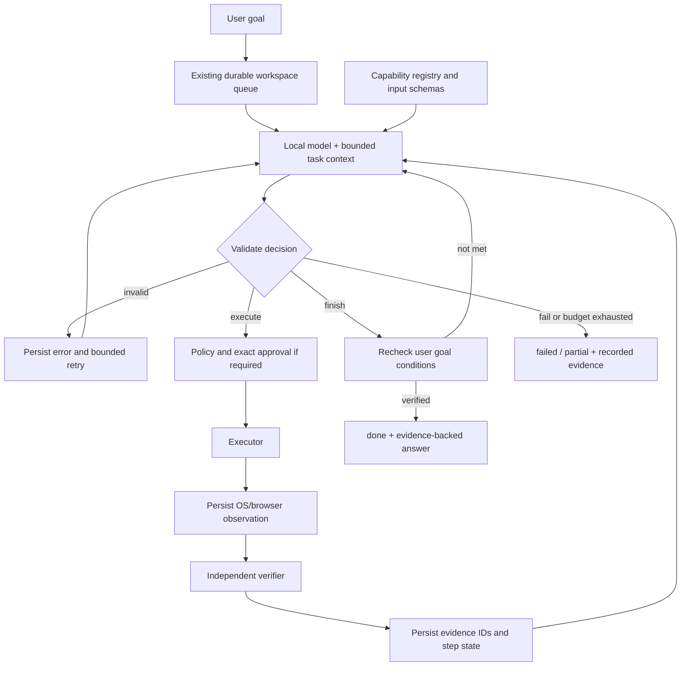
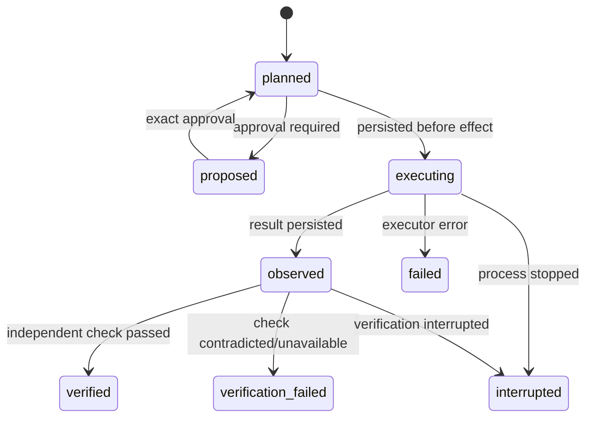

# M14 — Capability planning with independently verified execution

ARIES uses the existing `WorkspaceGoal`, `/api/aries/workspace` API, resource
reservations, supervisor and queue. M14 adds a registry-driven agent executor
inside that workspace. It does not introduce another task service or redesign
GTK/GNOME.

## Four separate responsibilities

- **Planner** proposes one structured decision. It cannot invoke a shell.
- **Executor** dispatches only a validated registered capability through policy.
- **Verifier** rereads external state after execution; executor success is insufficient.
- **Goal checker** matches user-derived conditions to fresh verified observations.



## Submission and decisions

`POST /api/aries/workspace` accepts the existing `request` field. Recognized
multi-step goal contracts and otherwise unrecognized single goals enter M14.
Existing exact commands and bounded workflows retain their established paths.
An explicit entry for any goal is:

```json
{"capability":"agent_task","args":{"task":"Open https://www.python.org and report the observed page title."}}
```

The model returns `execute`, `finish`, `fail`, or `ask_approval`, with fields
`capability`, `arguments`, `reason`, `summary`, and `evidence_refs` as appropriate.
Unknown names, extra fields, wrong argument types and malformed JSON are rejected
before execution. Generation uses a finite JSON grammar derived from the registry
because the installed Ollama grammar compiler rejects unconstrained dictionary
schemas. Pydantic performs a separate strict validation after generation.

Every model call, invalid result and retry is recorded. Two generation attempts
are permitted per decision; total calls are capped at `2 * (max_steps + 2)`.
Capability attempts, including refused attempts, are capped at
`workspace.agent_max_steps` (default 8, configurable 1–32). No terminal decision
can increase this budget. Exact verified/non-retryable repeated actions are refused.

To discourage invented terminal claims, the generation grammar excludes finish
until the known conditions have provisional evidence. For supported inspectable
goals it excludes fail before the first capability attempt. The model still selects
the capability and arguments. The runtime independently validates decisions and
rechecks completion; the grammar alone is not a correctness guarantee.

## Goal verification and its boundary

A conservative, anchored parser extracts completion conditions from **user text**.
It does not accept a model-authored checklist as proof that the user's intention
has been captured. Supported conditions include exact file create/read, OS
filesystem maximum usage, observed URL/title, explicit YouTube search query,
system/process inspection and simple installed-application launch.

File create/read checks the expected absolute path and content digest, rereads
current bytes, and requires both operations when the user asks for a read-back.
A verified read of another file cannot complete that goal. A changed file at finish
time prevents `done`. Storage answers are computed from the fresh probe values,
not taken from the model's summary. Browser answers use the current DOM title/URL;
a consent page cannot satisfy a YouTube search result requirement.

Arbitrary semantic goals can select safe capabilities and retain useful results,
but they remain `partial` when no independent completion contract exists. In
particular, M14 does **not** prove the semantic correctness of "important AI news",
a generated summary, or every possible phrasing. Extending completion predicates
is separate from extending capabilities. This is a generic bounded execution
architecture with deliberately limited completion oracles, not an unrestricted
agent claiming universal task success.

## Step persistence

New agent rows contain `schema_version: 2`, `agent_engine: m14`, and JSON arrays
for `steps`, `evidence`, `agent.decisions`, and `final_evidence_refs`. Existing SQL
columns and historical rows remain intact. Old saved agent plans retain their
legacy reader/executor compatibility; newly submitted agent tasks use M14.



A step records stable step/task IDs, index, decision, capability, arguments,
transitions, timestamps, execution result, bounded observation, verification,
evidence references, errors and model usage. Failure observations are evidence
of a failure report, explicitly `verified: false`, never proof of completion.

The supervisor records interrupted execution without replaying it. Existing
five-minute stale-claim reconciliation marks orphaned work interrupted. Restart
or manually requeueing an uncertain M14 action does not execute it again.
Dynamic-plan recovery remains explicitly refused; legacy bounded-plan recovery
continues to recheck effects and refresh reads. A resumable M14 approval is a
frozen unexecuted action, not a replay of an uncertain side effect. Approval uses
a conditional state-and-JSON update to avoid overwriting concurrently progressing
history.

## Policy and bounded observations

File creation is exclusive, inside allowed home paths and bound to exact
user-requested target/content when a contract is available. An inferred write
without a supported contract needs exact approval. Descriptor-relative
`O_NOFOLLOW` traversal prevents parent-symlink redirection during create/read.
This does not provide a transaction against every concurrent filesystem edit;
verification is a point-in-time observation.

Existing `operator.enabled`, `operator.confirm_model_plans`, privacy exclusions,
tool rate gates and approvals remain in effect. No package installation, deletion,
process kill, arbitrary POST, credential handling or model-generated shell is
registered for M14. Desktop launch dispatches the exact tool rather than passing
app text through a second model/router. Notifications record a policy decision;
that evidence does not prove a person saw the notification.

Planner context includes the goal, registry schemas, at most eight recent steps,
relevant reviews/preferences, goal conditions and remaining budget. Recursive
normalization caps strings, list items and JSON previews. Large outputs are
reported with truncation metadata; the planner never receives the whole system
history. Operational task/evidence retention follows the existing workspace
policy (30 days by default).

## Metrics

Per task: planner calls/time, capability attempts/time, capability and verification
failures, retries, invalid decisions, wrong capability names, final task status,
and token counters. Ollama `prompt_eval_count`/`eval_count` are recorded as measured
input/output tokens. A separate `character-count / 4` heuristic is labelled an
estimate, **not** a tokenizer measurement. `token_measurement_complete` identifies
partial/unavailable native totals; estimated values are never added to measured
ones. Approval resumes preserve accumulated metrics.

`wall_seconds` measures active execution invocations and includes planner waits;
it excludes time waiting in the queue or for approval. The live demo's `seconds`
measures submission-to-result elapsed time, including queue and approval handling.
Older development runs before the approval-timing fix undercounted `wall_seconds`;
use their demo elapsed time when comparing those records.

## Reproduce

```bash
./scripts/aries-agent-demo                 # four live local-model scenarios
./scripts/aries-agent-demo --no-browser    # explicitly excludes the browser case
PYTHONPATH=vendor/agentic-core:vendor:. .venv/bin/python tests/test_agent_execution.py
./scripts/test.sh
```

The live runner creates only its own Documents demo directory. It honors the
confirmation setting and approves only its exact disposable file content/path
and the explicitly requested public Python page. Unknown approvals stay pending.
All included scenarios must pass for exit code 0. Network/browser failure is
recorded as a failed included scenario, never silently relabelled as skipped.

Artifacts: `experiments/agent/<run>/report.md`, `result.json`, `tasks/`, `evidence/`.
Failed development attempts are retained. See [CAPABILITIES.md](CAPABILITIES.md),
[API.md](API.md), [RESEARCH_DEMO.md](RESEARCH_DEMO.md), and
[publication materials](publication/README.md).
