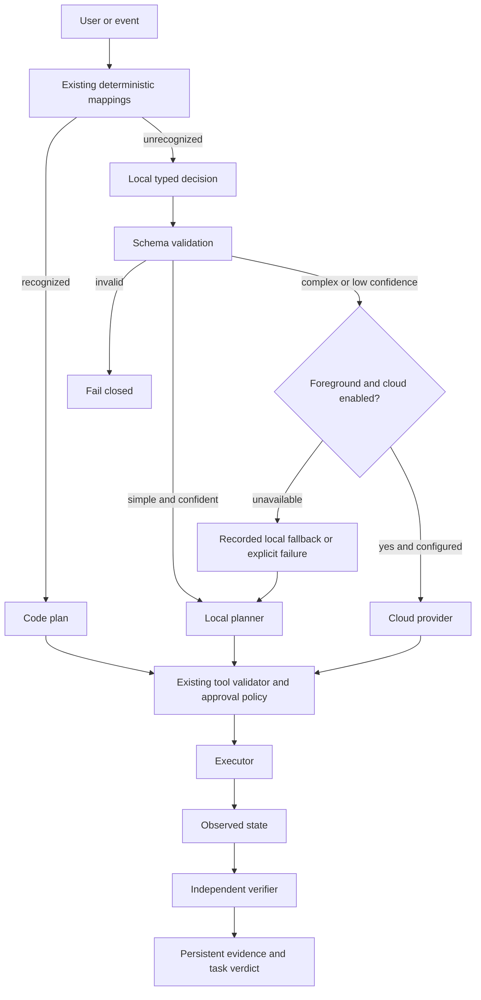

# Local-first intelligence

**18 September correction:** the intended cloud path is the installed terminal
`the reviewing agent` / `codex` login, not a separately configured HTTP API key. CLI adapters
are now implemented and enabled with `codex-cli` selected. Earlier evidence of
“unconfigured cloud” describes the superseded HTTP-only implementation.

ARIES resolves known commands with code, interprets uncertain intent locally,
and recommends cloud only when the local decision identifies complexity or
confidence falls below the configured threshold. A route is not permission to
execute a tool, nor evidence that a task is complete.



## Integration and call-site audit

The previous `aries/intelligence.py` is now the compatible package
`aries/intelligence/`. Existing imports of `arm`, `status` and `local_structured`
continue to work. This extends the existing workspace queue, Settings Service,
audit/persistence and API; there is no second tool executor or queue.

| Call site | Previous path | Current path |
|---|---|---|
| Known URLs/apps/files, system probes, health, automations | Rules and registered tools | Same code path; routing metadata recorded for workspace submissions |
| M14 `workspace/agent_planner.py` | Local structured model | Router once per task → selected provider → same strict capability schema/executor/verifier |
| Legacy `workspace/planner.py` | `local_structured` | Local provider interface/gateway; no implicit cloud |
| Coding generation/repair | Local structured model | Route once per task/session, policy-controlled structured generation; existing OS sandbox and verification |
| Operator `_from_model`, article reader, legacy workspace plan | Engine `providers.chat` | Existing engine protocol → local gateway compatibility endpoint |
| Connector content understanding | Engine `providers.chat` | Local gateway only; content understanding does not authorize side effects |
| Scheduler, filesystem/source polling, health checks | Deterministic workers/probes | Unchanged; no model requests for idle polling |

The gateway exposes an Ollama-compatible `/api/chat` transport for existing engine
consumers, but its underlying runtime is selected through `ModelProvider`.
`/api/tags` is a health compatibility endpoint. Native Ollama and local
OpenAI-compatible runtimes (for example llama.cpp/vLLM) have adapters. A
Hugging Face runtime needs a compatible HTTP server or a new adapter; it is not
bundled or downloaded. The default engine remains armed to a local-only transport.
Article summarization remains local; cloud escalation currently applies to routed
M14 planning, coding generation and explicit evaluation, not every legacy call.

## Services and lifecycle

`aries-local-model.service` is a persistent user service bound to
**127.0.0.1:11435**, with restart-on-failure and two concurrent inference slots.
It fronts the existing persistent `ollama.service` on **127.0.0.1:11434**; it does
not launch another Ollama per request. Model residency defaults to `15m` between
requests, configurable independently of service lifetime. A model can unload
when idle without stopping either service.

`aries-core.service` has `Wants` and `After` for the gateway, not a hard `Requires`:
core still starts if inference fails. The separately enabled Ollama unit owns its
runtime restart policy. Alternative runtimes must install their own persistent
service; the gateway health probe reports unavailable until that runtime starts.
No model download, shell command from a model, LAN bind or network proxy is used.
Local endpoint settings require HTTP literal loopback IPs; runtime redirects are
not followed. The gateway rejects non-loopback clients and browser Origin headers.

```bash
./scripts/aries-service reinstall
systemctl --user status aries-core.service aries-local-model.service ollama.service
journalctl --user -u aries-local-model.service -n 50
curl http://127.0.0.1:11435/health
```

User lingering was enabled during validation, allowing services to survive logout.
This does not defeat shutdown, suspend, thermal limits or a failed runtime. The
existing Power panel controls the sleep inhibitor; it was not enabled by this
change. The observed machine already does not automatically suspend on AC.
No 24-hour uptime or electrical energy measurement has been claimed.

## Settings and cloud policy

Settings live in the existing Settings Service/API and generated Control Centre
settings UI. They are not a second YAML configuration.

| Key prefix `intelligence.` | Default / meaning |
|---|---|
| `location` | `local`; `none` disables both local and cloud inference |
| `router_enabled` | `true`; controls M14 routing, existing code mappings remain |
| `local_backend` | `ollama` or `openai-compatible` |
| `local_url` | `http://127.0.0.1:11434`; actual runtime address |
| `local_model` | `qwen2.5:7b` |
| `gateway_enabled`, `gateway_url` | `true`, `http://127.0.0.1:11435` |
| `keep_alive` | `15m` for Ollama model residency |
| `local_confidence_threshold` | `0.82` |
| `cloud_enabled` | Default `false`; enabled on this installation at the user’s explicit request |
| `cloud_provider` | `claude-cli`, `codex-cli`, or optional `openai-compatible`; this installation uses `codex-cli` |
| `cloud_cli_timeout_seconds` | `180`; subprocess deadline and process-group cleanup |
| `cloud_model` | Optional CLI override; empty means CLI default |
| `cloud_url` | Used only by optional HTTP adapter |
| `cloud_local_fallback` | `true`; recorded degradation if cloud is unavailable |
| `cloud_input_usd_per_million`, `cloud_output_usd_per_million` | `0` means **unknown price**, not free inference |

Cloud CLI calls use the existing terminal authentication. No new API key is
required. The optional HTTP adapter alone uses `ARIES_CLOUD_API_KEY` and an
explicit model/endpoint. CLI discovery checks PATH and `~/.local/bin`, including
under the user systemd service. A missing executable, quota error or timeout is
recorded and follows the configured local fallback; no hidden switch to another
cloud provider happens.

the reviewing agent runs in non-interactive safe mode, with no tools/MCP/custom hooks and no
session persistence. Codex runs ephemeral/read-only with user config, shell,
unified exec, apps, plugins, hooks, multi-agent and web search disabled. Existing
login is preserved; prompts go through stdin and fixed argv, never shell strings.
Only the resulting decision enters ARIES's tool validator/executor. Fresh private
temporary working directories are cleaned afterwards. Output is bounded to 2 MB,
final answers to 200 KB and requests to the configured timeout. The requested
output-token limit is advisory for CLI; the timeout and byte limits are enforced.

Codex integration parameters were checked against installed CLI help and the
[official configuration reference](https://learn.chatgpt.com/docs/config-file/config-reference)
and [non-interactive documentation](https://learn.chatgpt.com/docs/non-interactive-mode).
Cloud generation uses each CLI's native JSON/JSONL usage. the reviewing agent cache-read and
cache-write input are retained separately and included in total input; Codex
already reports total input with a separate cached subset. CLI reported nominal
cost is **not a subscription invoice** and is stored separately from configured
HTTP API price estimates. Unknown charged cost remains null.

Background routes cannot choose cloud. Invalid local JSON/schema is an explicit
failure, not grounds to execute text or silently ask cloud. Low confidence or
local runtime outage can recommend cloud, but that recommendation still passes
cloud configuration/policy. When cloud is disabled/unconfigured, ordinary M14
planning falls back locally with recorded reason, or fails if fallback is disabled.
The explicit all-cloud benchmark never substitutes a local model.

Confidence is self-reported and **not calibrated probability**. Tool labels in
`Decision` are constrained enums and advisory; actual arguments are generated
and validated by the existing capability planner. `should_execute` in notification
classification is constrained to false. Low-priority classification has a
separate deterministic notification veto. Both raw and policy-filtered decisions
are returned; actual delivery still uses ARIES's existing notification policy.

## Persistence, metrics and safe caching

`aries_intelligence_events` stores timestamp, route/reason, provider/model,
purpose, measured native input/output tokens, latency, success/failure, fallback
and configured-price cost estimates. Failed/unknown usage is retained as unknown,
not zero measured cost. Raw prompts are not stored in this table, but model
reasons can contain excerpts; existing retention is 30 days. Workspace step
history continues to preserve its own planner decisions/evidence.

`/api/aries/intelligence/stats` summarizes the most recent 10,000 retained events,
explicitly identifying its window. Router invocations include previews, so they
are not the number of distinct completed tasks. Completed outcomes are reported
separately, using actual provider usage for M14 rather than a cloud recommendation
that fell back to local. Legacy `/api/chat` calls are counted as local generation.
Direct diagnostic gateway `/generate` calls are not included in core accounting;
normal core requests are recorded by their calling layer without double counting.

Usage is scoped to ARIES-initiated calls, not the user's the reviewing agent/Codex account.
Other terminal sessions and applications are outside these measurements. Shared
subscription limits can be consumed elsewhere; remaining account quota is unknown.
`measured_cloud_*_tokens` are known subtotals; `cloud_*_tokens_total` is null
when any retained cloud call lacks that count. Neither nominal CLI costs nor
these token counts establish a subscription bill or account-wide savings.

Exact normalized command hashes can cache a verified, high-confidence harmless
classification/extraction/system routing hint for seven days. No fuzzy action
learning, URL/argument replay, credential handling or sensitive operation is
learned. Cached hints skip classification, not execution policy or verification.
Known website/application mappings already execute deterministically without
learning. Cache entries never assert that the current environment is unchanged.

`DecisionProvider` permits a future Jev-like adapter without integrating Jev.
Implement `decide(db, text) -> Decision`, then retain the same router, validation
and execution boundary. `ModelProvider` independently handles inference transport.

## Evaluation and evidence

```bash
./scripts/aries-intelligence-eval
./scripts/aries-intelligence-eval --repeats 3
# Requires deliberately configured cloud access; consumes real API tokens:
./scripts/aries-intelligence-eval --cloud-baseline
./scripts/aries-intelligence-ab
./scripts/aries-agent-demo
./scripts/test.sh
```

The routing fixture contains five deterministic, four local and four complex
cases. It reports routing and intent accuracy, local intent accuracy, false/missed
escalation, latency and native local token usage. It separately runs a real system
probe through the task queue. Routing accuracy is never substituted for task
completion, tool execution or independent verification success.

The optional all-cloud classification arm performs actual calls and records
native counts; unavailable cloud is not a zero-cost successful baseline. The
paired execution runner exercises system status, storage and a missing-file
negative control under A (forced cloud planner) versus B (normal code/local/cloud).
Both share executors and verifiers; alternating order limits but does not remove
session/order effects. Separate tasks preserve steps, native usage and evidence.
These small controls are not proof of equivalent general task success.

First development run `20260917T215134Z-9d5ad3`: routing 11/13, intent 7/13;
two unnecessary escalations. After adding explicit intent definitions to the
classifier prompt, `20260917T215420Z-74ab42`: routing and intent 13/13, local
intent 4/4, false/missed escalation 0 on this reused fixture. Mean routing latency
0.641 seconds, native local tokens 1,914 input + 429 output. All attempts remain.
These are development results, not held-out statistical confirmation.

The real M14 execution demo `experiments/agent/20260917T215447Z-f7bdba/` passed
4/4 through the gateway. The initial A/B execution attempt records B 2/2 and A
unavailable: paired savings/success differences remain null. No percentage API
saving or cost advantage is claimed without a measured usable baseline.

Live service, routing, classification, cloud policy refusal, intentional gateway
outage/fallback/recovery and background no-cloud evidence is retained in
`experiments/intelligence/validation-20260917/live-validation.json`. All services
were restored after the fault test. Backend-native outage, invalid decisions,
cloud response/failure and accounting are additionally covered by deterministic
unit/integration tests with clearly simulated providers.

Final replication `20260917T220113Z-49e29a` again achieved routing/intent 13/13
(1,914 native input + 451 output tokens, mean 0.675 seconds). The expanded paired
execution runner recorded B 3/3 and A unavailable in `20260917T220125Z-ab-8a2e51`;
paired savings remain null. Final M14 run `20260917T220135Z-27c955` passed 4/4.


Terminal correction validation: `experiments/intelligence/cli-20260918/`.
Real Codex paired run `20260917T222712Z-ab-f2e66d` passed A 3/3 and B 3/3.
A used six CLI cloud calls (77,151 native tokens including cached input); B used
zero cloud calls and four local calls plus a deterministic system probe. This
small engineering fixture does not establish general equivalence or USD savings.
All regression suites passed, including 63 intelligence checks. the reviewing agent's initial
429 session-limit response is retained separately from Codex success.
