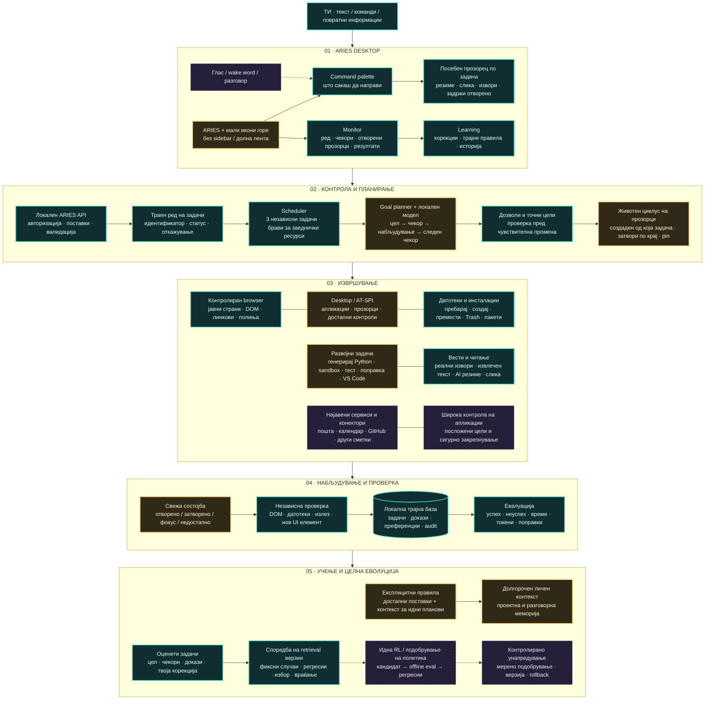

# ARIES / Jarvis — target architecture

Green: implemented bounded capabilities. Amber: partial or current integration. Purple dashed: future work. This is the target system, not a claim that everything is complete.

Feedback currently updates supported settings and supplies explicit preferences to the local goal planner. It does not train model weights. Desktop top-panel changes require a new GNOME session; native response windows can reload independently.
