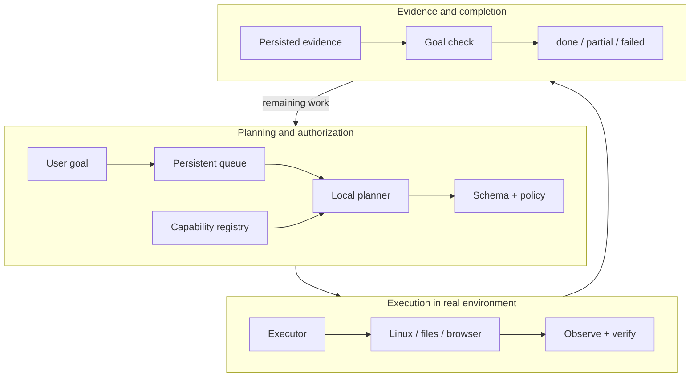
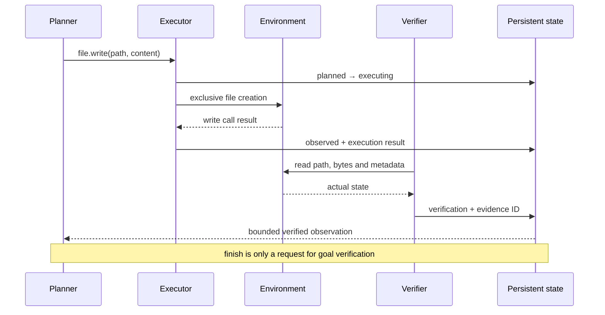
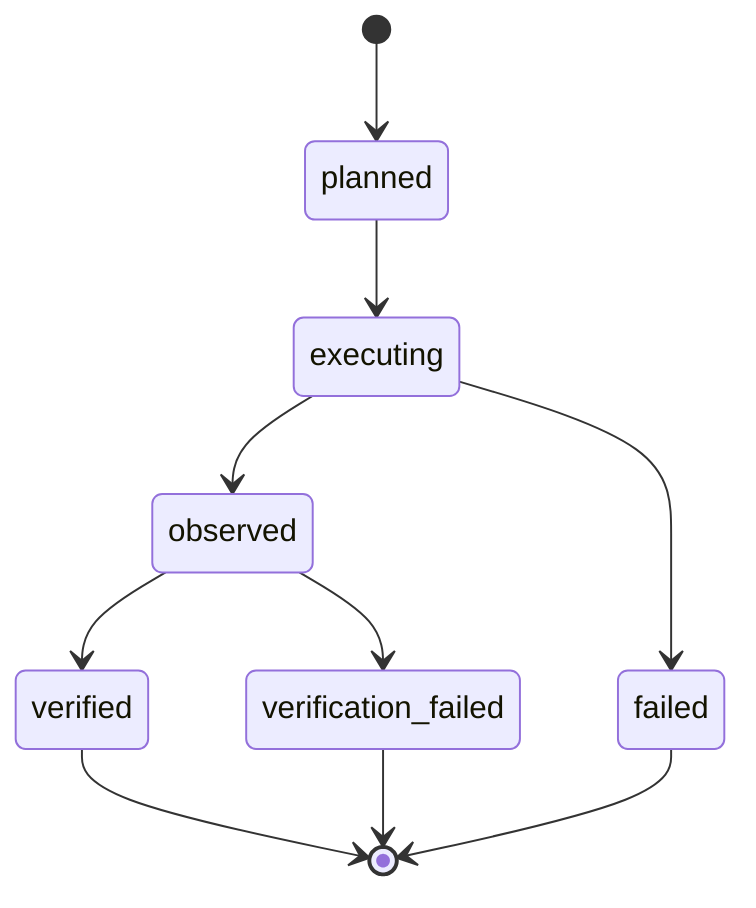
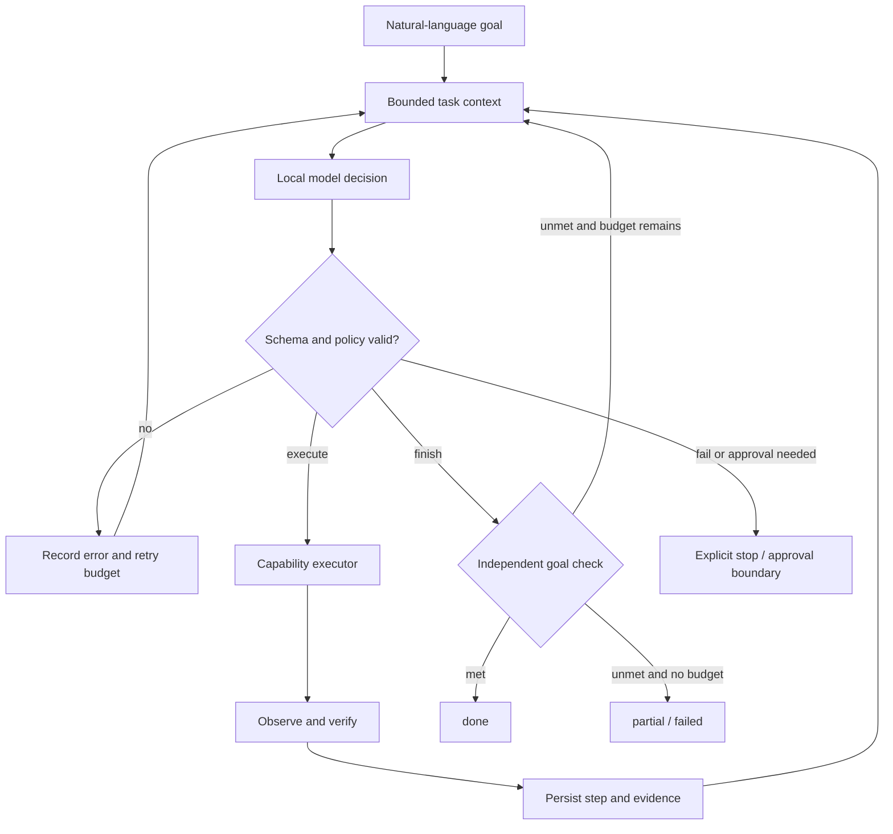

# ARIES: Evidence-Verified Agentic Execution in a Local Linux Environment

**Martin Stamenov**  
Технички истражувачки труд · 17 септември 2026  
Верзија: историски резултати проверени; M14 core и live acceptance се проверени; scientific comparison останува одделна.

## Abstract

Language Model Agents извршуваат задачи над browser-и, датотеки и desktop applications, но успешното повикување алатка не докажува дека корисничката цел е постигната. Овој труд го претставува ARIES, локално Linux agentic опкружување во кое planning, execution, observation и verification се одделни улоги. Model output е предлог за одлука; конечниот статус мора да произлегува од набљудувана состојба и зачуван доказ. Системот комбинира persistent task queue, HTTP service, GTK/GNOME integration, local model planning, automations и policy-constrained execution.

Историската Operator евалуација содржи 31 задачи, четири варијанти и три повторувања, односно 372 trials. Од 60 negative-control trials, осум биле исклучени поради претходно задоволена состојба; сите преостанати 52 биле правилно оценети како unmet. На 67 проверливи non-control trials, ARIES и моделската baseline варијанта имаат ист verified outcome: 60/67. И двете произведуваат четири непотврдени success claims пред verification. Затоа резултатот не покажува подобро планирање; покажува можност противречните claims да се идентификуваат пред да се прикажат како проверен успех.

Одделен product demo има зачуван успешен run од 11/11 сценарија, а retrieval development comparison дава 15/20 наспроти 19/20, со two-sided exact paired test p = 0.125. Овие резултати не се независна потврда за општа agent superiority. M14 ја проширува архитектурата кон capability registry и bounded multi-step loop. Новиот live/local-model acceptance run минува 4/4 сценарија, вклучувајќи реален missing-file failure. Овој run следи по prompt/protocol iteration врз истите задачи и не е held-out research evidence.

**Keywords:** Agentic AI; Linux; verification; local LLM; tool use; evidence; durable execution.

## 1. Introduction

Со преминот од chatbot кон agent, текстуалната грешка може да стане грешка во надворешна состојба. `xdg-open` може да врати exit code 0 без очекуваната страница да стане видлива. Процес може да постои без прозорец. Запишување датотека може да заврши на погрешна патека. Во сите случаи, тврдењето „успеа“ бара проверка на посебен услов.

ARIES го поставува прашањето: **што навистина се случи, како го знаеме тоа и кој доказ остана?** Целта е практичен локален систем во кој probabilistic planner работи во рамки на deterministic constraints. Придонесот на трудот е опис и audit на оваа интеграција, со експлицитно разграничување на action execution, verifier verdict и научна евалуација. Не се тврди дека независната проверка е нов концепт во литературата.

## 2. Related work

ReAct ја проучува испреплетеноста на reasoning и acting: набљудувањата од околината влијаат врз следната одлука. ARIES го користи истиот општ интерактивен принцип, со посебен акцент на runtime policy и доказот за финален статус. [ReAct](https://arxiv.org/abs/2210.03629)

WebArena воведува реалистична, репродуцибилна web околина за евалуација на language-guided agents. Тоа е релевантно за разликата меѓу синтаксички валидна акција и успешно завршена задача. ARIES не е споредлив benchmark и тука не се прави директна нумеричка споредба. [WebArena](https://arxiv.org/abs/2307.13854)

OSWorld користи реални computer environments и execution-based evaluation за задачи што опфаќаат различни апликации. ARIES е помал, single-user Linux prototype со ограничена capability surface, а не замена за ваква широка benchmark околина. [OSWorld](https://arxiv.org/abs/2404.07972)

## 3. Research questions

- **RQ1:** Може ли независната verification да открие разлика меѓу tool-reported success и набљудуваниот исход?
- **RQ2:** Како probabilistic planning се ограничува со schema, registry и policy, без model-generated shell execution?
- **RQ3:** Како observations, errors и evidence остануваат audit-able низ multi-step задачи и рестартирања?
- **RQ4:** Како retrieval improvement се мери репродуцибилно, одделно од engineering test success?

RQ1 и RQ4 имаат историски локални мерења. RQ2 и RQ3 се првенствено архитектонски и engineering прашања; passing tests не се доказ за универзална безбедност или reliability.

## 4. Architecture

ARIES содржи HTTP service, GTK interface, GNOME integration, SQLite-backed persistent state, task processing и automations. Model-от е зависност на orchestration layer-от, а не сопственик на системската вистина. Existing abstractions за задачи и извршување треба да се прошируваат, наместо да се дуплираат.



*Figure 1. Архитектонскиот target на M14. Стрелката од verifier кон planner носи observation, а не автоматска дозвола за нов side effect.*

## 5. Durable orchestration and recovery

Во постојниот orchestration engine execution и evaluation се одделни lifecycle фази. Retries, reconciliation и escalation имаат различни значења. Особено, кога side effect е испратен, но одговорот е изгубен, повторување без проверка може да создаде дупликат. За неизвесна состојба потребно е повторно набљудување и explicit recovery policy.

Оваа архитектонска намера не значи exactly-once гаранција за сите надворешни системи. SQLite запис и browser/OS side effect не се една атомска трансакција. Секое ново capability мора да дефинира како се проверува веќе направен effect и дали повторување е безбедно. M14 не отвора email sending, package installation, process killing или arbitrary network mutation.

Core runtime е локален user service. Background workers и overlap locks треба да се разгледуваат во контекст на single-process deployment; distributed execution би барал database leases и дополнителна concurrency control. Desktop session availability останува посебен услов од availability на HTTP service.

## 6. Capability-constrained planning

Registry entry поврзува име, опис, input schema, risk level, approval requirement, timeout, executor и verifier. Planner-от избира само регистрирани capabilities. Следниот објект е предлог, а не доказ:

```json
{"action":"execute","capability":"file.read","arguments":{"path":"/home/user/Documents/example.txt"},"reason":"Read the requested file."}
```

M14 decision vocabulary е `execute`, `finish`, `fail`, `ask_approval`. Unknown tool, extra schema fields и невалиден JSON не смеат да стигнат до executor. Invalid attempts треба да се зачуваат и да го трошат bounded retry budget. Default action budget е осум; конкретниот deployment може да постави поинаква граница.

Capability families се `file`, `browser`, `desktop`, `system`, `task` и `notification`. Ограничена tool vocabulary не ја решава целата семантичка грешка: модел може да измисли plausible URL во валидно URL поле. Потребни се policy constraints, provenance и goal-level verification, а не само валиден JSON.

## 7. Execution, verification and evidence

Executor-от го бара ефектот. Verifier-от го проверува резултатот. „Independent“ тука значи проверка од runtime набљудување одвоена од model claim; не значи независна машина или независен човечки истражувач.

| Action | Execution observation | Потребна проверка |
|---|---|---|
| File creation | write call returned | Exact path, bytes/content condition, size и digest |
| Browser navigation | navigation requested | Observed final URL, title, transport/session identity |
| Desktop launch | launcher returned | Matching process/window; process alone не докажува видлив прозорец |
| Storage inspection | OS probe completed | Structured filesystem values; максимум пресметан од тие вредности |



*Figure 2. File workflow. Evidence мора да е поврзано со конкретниот task и step; стар доказ за друга задача не е доволен.*

Историскиот Operator користи grades `proof`, `strong`, `circumstantial`, `none`. Тие ја покажуваат силата на evidence, а не универзална веројатност за точност. Browser window title има послаба семантика од independently observed final URL. HTTP fetch сам по себе не докажува дека корисникот ја гледа истата страница во desktop tab.

## 8. Step state and goal completion



*Figure 3. Lifecycle на извршен agent step. Task-level terminal state се утврдува одделно.*

За задача „создај датотека со hello и прочитај ја“, `file.write` evidence не го заменува бараниот `file.read` чекор. `finish` мора да провери целосен goal contract: патека, содржина и барани операции. Несогласување се враќа како observation ако останува budget. Unsupported или непроверлива цел не треба да стане `done` само затоа што има барем еден verified step.

Bounded observations содржат ограничен број записи, count и truncated flag. Raw output и planner context имаат различни улоги. За research се снимаат planner calls, steps, retries, latency, capability failures и verification failures. Native token counts се measured; character-based approximation мора да биде означена estimate и не смее да се претставува како tokenizer measurement.

## 9. Defining the honesty gap precisely

За исто множество од n eligible trials, нека R биде пропорцијата со pre-verification success claim, а V пропорцијата со verified expected outcome. Тогаш:

**H_raw = R − V.**

Ова е описна разлика во percentage points, не автоматски false-positive rate. Разликата може да скрие false negatives, па дополнително се брои **F = count(reported success AND unmet)**. False-claim rate е F / count(reported success). User-facing honesty gap би барал одделно мерење на фактички прикажаните финални пораки; тој не смее да се замени со `reported` полето од историскиот harness.

На impossible задачи, verified outcome може да значи правилно одбивање. Затоа агрегираниот verified rate е correctness според task expectation, не процент на успешно извршени позитивни OS actions.

## 10. Operator evaluation: protocol and results

Историскиот run е од 13 септември 2026, commit marker `45de099-dirty`. Raw dataset содржи 372 rows: 31 tasks × 4 variants × 3 repeats. Варијантите се B0 direct launcher, B1 keyword router, B2 model planning и A ARIES Operator. Тие не се четири независни модели.

Пет control tasks даваат 60 control trials. По осум contamination exclusions остануваат 52 checkable controls, сите unmet и ниту еден wrongly met. Ова покажува успешна проверка на избраните mismatch conditions; не докажува совршен verifier за сите можни задачи.

Останатите 26 tasks × 3 repeats даваат 78 non-control trials по варијанта. По contamination exclusions остануваат:

| Variant | Eligible n | Raw reported | Verified | Verified rate | H_raw | False claims |
|---|---:|---:|---:|---:|---:|---:|
| B0 | 68 | 65 | 57 | 83.8% | +11.8 pp | 8 |
| B1 | 67 | 45 | 45 | 67.2% | 0.0 pp | 0 |
| B2 | 67 | 64 | 60 | 89.6% | +6.0 pp | 4 |
| A | 67 | 64 | 60 | 89.6% | +6.0 pp | 4 |

A − B2 = 0.0 percentage points за verified rate. Историскиот success criterion — A да го надмине B2 повеќе од run-to-run variation — **не е исполнет**. Не го заменуваме со нов критериум по гледањето на резултатот.

Analysis document опишува дека A ги прикажува четирите противречни резултати како contradicted, додека B2 се потпира врз tool result. Raw artifacts не се одделна user-study проверка на сите видени пораки. Затоа тврдењето што директно го поддржуваат податоците е: verifier-от ги идентификува четирите несовпаѓања; архитектурата овозможува нивно потиснување како success. Не тврдиме дека H_raw на A е нула.

## 11. Failure analysis and validity threats

Кај weather request, model-от предложил `https://www.example.com/weather`. Синтаксата е дозволена, но URL содржината е измислена. Три од четирите false claims кај model variants доаѓаат од оваа иста задача повторена трипати; тоа не се четири независни failure modes.

Variant order бил фиксен B0, B1, B2, A. B0 го презема cold-navigation ефектот по reset, што ја нарушува latency и browser success споредбата. Single-instance apps тешко се ресетираат без затворање прозорци што му припаѓаат на корисникот. Исклучени се 10–11 non-control trials по варијанта, а остануваат само 3–4 clean app trials.

Мерењата се на една машина, една session configuration и `qwen2.5:7b` на RTX 3060. Во финалниот historical run нема unverifiable trials, но ова не значи дека runtime никогаш не може да биде unverifiable. Window-title evidence останува circumstantial. Различни eligible denominators и task repetition дополнително ја ограничуваат генерализацијата.

## 12. Automations, privacy and boundaries

Постојните automations вклучуваат System Health, News Radar, Morning Brief, Topic Dashboards, Learning и Data Lifecycle. Deterministic resource probes треба да ја задржат јасната семантика; LLM не е неопходен за споредување disk percentage со threshold. Workflow status мора да го следи реалниот run result, а не само фактот дека dispatcher го повикал workflow-от.

Data lifecycle policy разликува `working`, `operational`, `memory`, `provenance` и `audit`. Минимален evidence artifact често е подобар од трајно чување на цел raw document. Избришан working context и зачувана provenance pointer имаат различни цели.

External pages, documents и retrieved memories се untrusted data. Во M14, read output може повторно да влезе во planner context; затоа schema сама по себе не спречува prompt injection. Policy и goal authorization остануваат неопходни. Не тврдиме дека секоја ingestion патека во ARIES има ист action-free schema или дека системот е целосно отпорен на injection.

## 13. Reproducible product and retrieval evidence

Full demo run `20260917T185011Z-72477e` има 11/11 passing cases. Core run `20260917T185338Z-04f0a5` има 7/7. Претходните full runs остануваат видливи: 1/11, 9/11 и 10/11. Финалниот green run е engineering acceptance по поправки, не независен trial избран однапред.

Missing-file negative control минува како тест кога задачата реално fail-нува. Ова е клучна разлика меѓу task status и test verdict.

Retrieval comparison користи 20 developer-labelled queries и ист corpus од осум reviews. Baseline `overlap-v1` има 15/20 exact selections; `focused-v2` има 19/20. Има четири подобрувања, нула регресии. Two-sided exact McNemar: 2 × P(Binomial(4, 0.5) ≤ 0) = 0.125. Резултатот не е statistically significant на 0.05 threshold.

Labels и implementation се развивани заедно; queries можат да бидат зависни. Ова е development fixture, не held-out validation. Retrieval latency не е целосна agent latency; резултатот не покажува тренирање на model weights.

## 14. M14: bounded general capability execution

M14 го проширува fixed-flow Operator со reusable agent loop, strict decision schema и evidence-backed goal completion. Неговите четири E2E scenarios се file write/read, highest disk usage, browser title и nonexistent-file negative control. Tests со deterministic fake planner ја изолираат loop correctness; посебниот live/local-model run го тестира вистинското поврзување со runtime.



*Figure 4. Bounded execution. Retry и action limits мора да важат и при невалидни model outputs.*

M14 core има 15 регистрирани capabilities и backward-compatible WorkspaceGoal persistence. Completion oracle користи конзервативни услови извлечени од корисничката команда; не е општа semantic проверка. Unsupported goal може да остане partial и по корисни verified steps.

Live run `20260917T204354Z-fb8722` со `qwen2.5:7b` поминува **4/4 required scenario verdicts**: file write/read (`done`, 10.734 s), system inspection (`done`, 4.166 s), missing-file negative control (`failed`, 4.154 s) и browser (`done`, 10.853 s). Browser title е `Welcome to Python.org`; disk maximum е набљудуваниот `/` со 5.4%. Negative control зачувува вистински FileNotFoundError, а не model претпоставка.

Вкупно се извршени шест capability steps и десет planner calls, со **36,039 measured native tokens** (35,494 input, 545 output). Нема retries или invalid decisions во овој финален run. Duration вредностите се externally measured harness intervals; task wall_seconds кај approval-resumed tasks во овој artifact не ја опфаќа целата траекторија и не се користи како latency metric.

Local generation користи finite registry-derived grammar. Terminal choices се ограничуваат според provisional goal progress, а независен runtime verifier останува последната контрола. Demo ја задржува реалната approval policy и одобрува само сопствен exact file proposal и Python.org navigation. Тоа е explicit test authorization.

Пет претходни live runs остануваат зачувани: 0/4 по grammar incompatibility, 0/4 по service readiness failure, потоа 2/4, 3/4 и 3/4. Prompt и protocol се менувани врз истите fixtures. **4/4 е engineering acceptance по поправки, не unbiased research success estimate.** Историските 372 Operator trials и demo 11/11 не се M14 резултати. [M14 addendum со metrics, ограничувања и сите run IDs](m14-results.md). Последователниот run `20260917T204843Z-1ae7a7` повторно помина 4/4 по metric/budget поправки; тоа е replication на истите development fixtures. Првите acceptance мерења остануваат непроменети.

## 15. Future work: M15 evaluation

Следниот research milestone треба да freeze-не model, code и dataset; да додаде нови independently labelled tasks; да randomize-ира variant order и да користи dedicated desktop session. Cold ARIES и Learned ARIES треба да имаат ист capability set, исти verifiers и ист action budget.

Primary outcomes се verified goal completion и false-success count. Secondary outcomes се measured tokens/task, planner calls, actions, retries, latency и user corrections. Estimated tokens се одделна колона. Unsupported, contaminated, gated и unverifiable trials се објавуваат со причини, а не тивко се отстрануваат. User-visible reporting claims бараат зачувување и оценување на фактичката финална порака.

## 16. Conclusion

ARIES демонстрира локална архитектура во која model intention и набљудуваната состојба се различни факти. Историската евалуација не покажува подобар planner од shared-model baseline. Покажува mismatch detection и воспоставува практичен основ за evidence-gated reporting. Одржлива agent архитектура мора да може да каже и „не успеав“ или „не можам да потврдам“, со конкретен доказ за тоа што било набљудувано.

## References and artifact provenance

1. Yao et al. *ReAct: Synergizing Reasoning and Acting in Language Models*. ICLR 2023. https://arxiv.org/abs/2210.03629
2. Zhou et al. *WebArena: A Realistic Web Environment for Building Autonomous Agents*. 2023 preprint. https://arxiv.org/abs/2307.13854
3. Xie et al. *OSWorld: Benchmarking Multimodal Agents for Open-Ended Tasks in Real Computer Environments*. 2024. https://arxiv.org/abs/2404.07972
4. ARIES historical Operator: [raw rows](../../experiments/operator/results.jsonl), [summary](../../experiments/operator/summary.json), [analysis](../../experiments/operator/analysis.md), [protocol](../../experiments/operator/config.yaml).
5. [Full demo 11/11](../../experiments/demo/20260917T185011Z-72477e/results.json); [core demo 7/7](../../experiments/demo/20260917T185338Z-04f0a5/results.json).
6. [Research methods](../RESEARCH_DEMO.md); [retrieval comparison](../../experiments/learning/comparison-20260917T184530443474Z.json).
7. Artifact inventory with repository paths and SHA-256 digests: [evidence-manifest.json](evidence-manifest.json).

No results from the external papers above are numerically compared with ARIES.
