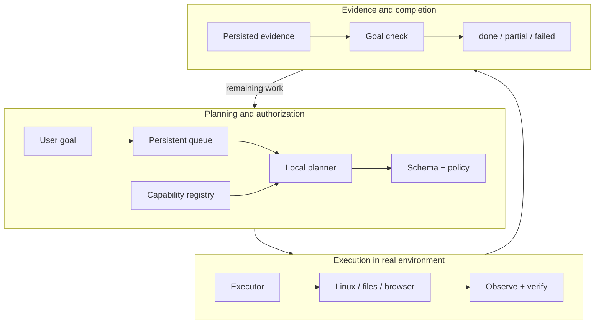
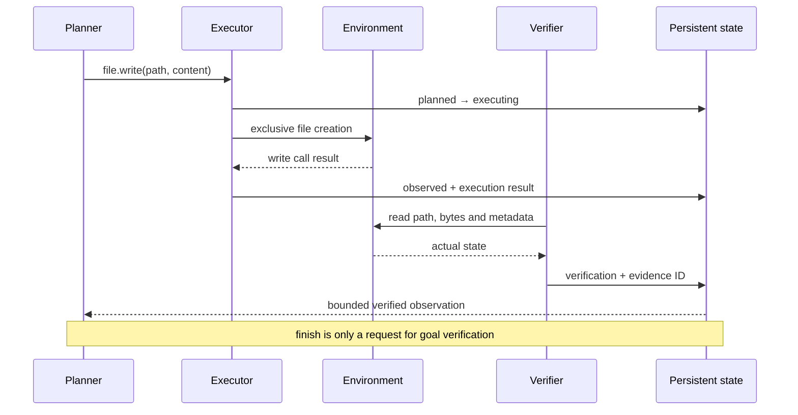
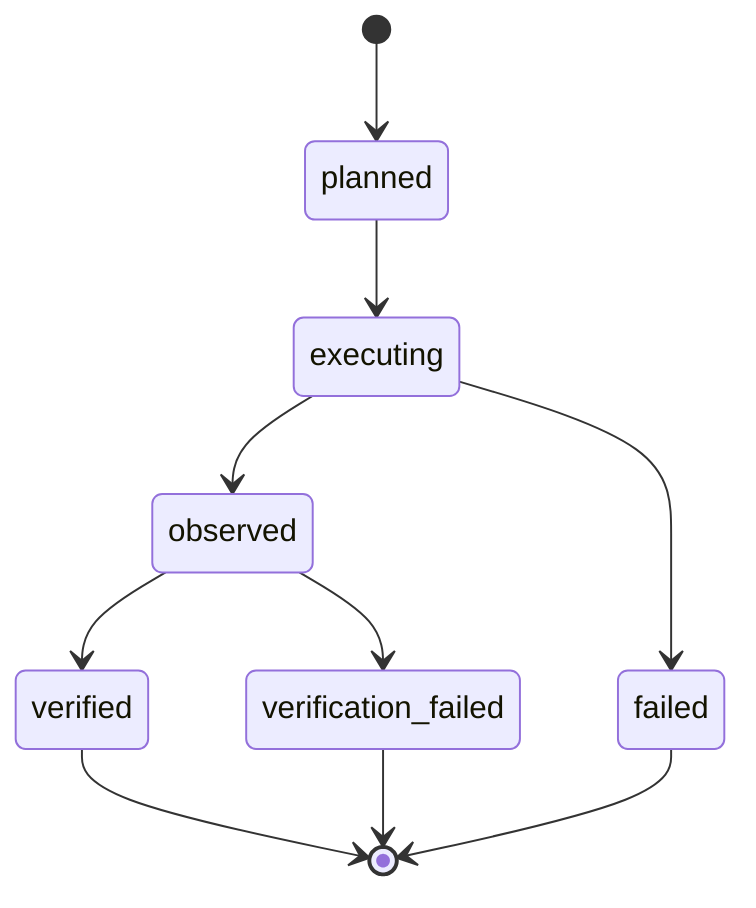
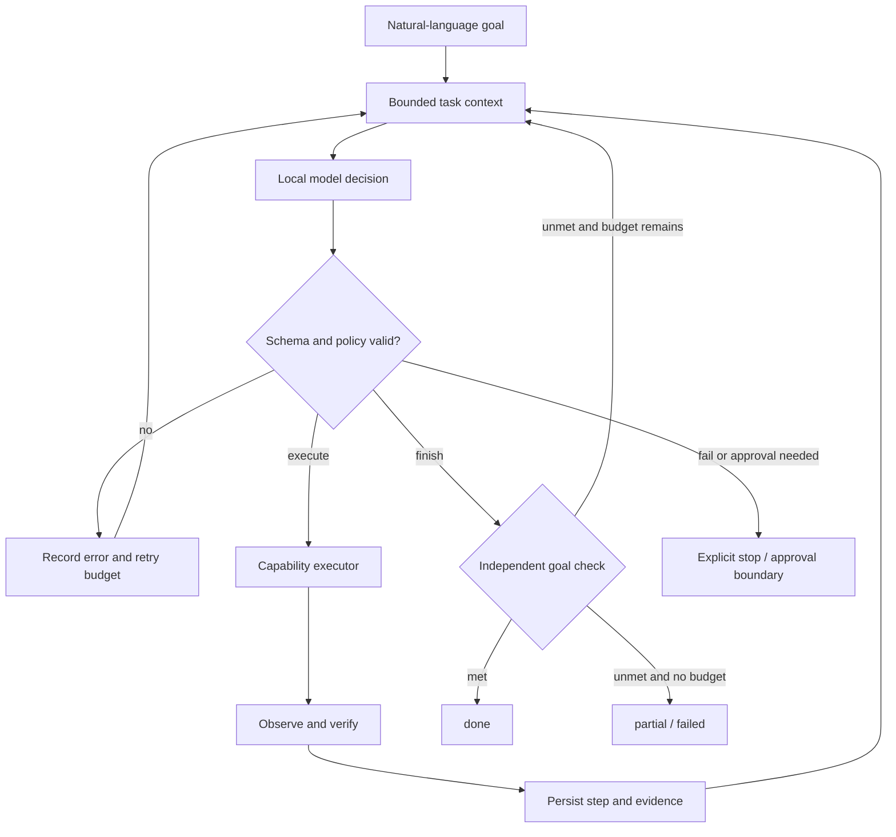

# ARIES: Evidence-Verified Agentic Execution in a Local Linux Environment

**Martin Stamenov**

Historical results and M14 are separate. See [paper](paper.md) and [M14 addendum](m14-results.md).

---

## 1. Evidence-Verified Agentic Execution in a Local Linux Environment

Martin Stamenov
Локален Linux agent · истражувачки прототип
17 септември 2026

---

## 2. Exit code 0 ≠ постигната цел

Launcher може да успее без видлив прозорец.
Browser request може да заврши на друга страница.
Model-generated success не е доказ.

---

## 3. Model output is not evidence

Planner предлага. Executor дејствува.
Verifier ја набљудува состојбата.
Task done бара проверен goal condition.

---

## 4. Четири прашања

RQ1 · Дали verification открива false-success claims?
RQ2 · Може ли planning да остане capability-constrained?
RQ3 · Дали evidence преживува failures и restarts?
RQ4 · Како reproducibly се споредува retrieval?

---

## 5. Од цел до доказ

---

## 6. Проверка на реалната датотека

---

## 7. Секој исход останува видлив

---

## 8. Capability name + validated arguments

Registry → schema → policy → executor.
Нема model-generated shell execution.
Нема автоматско deletion, killing или installation.
Valid JSON не значи semantic correctness.

---

## 9. Две мерки, различни прашања

H_raw = reported rate − verified rate
False claims = reported success AND unmet
Raw claims и финалните user-visible пораки се различни.
Verified impossible task може да значи правилно одбивање.

---

## 10. 372 trials · историски run

31 tasks × 4 variants × 3 repeats
B0 launcher · B1 keywords · B2 model · A ARIES
60 control trials → 8 contaminated excluded
52/52 eligible controls correctly UNMET

---

## 11. Verification ≠ подобар planner

| Variant | Verified / n | H_raw | False claims |
| --- | --- | --- | --- |
| B0 | 57 / 68 | +11.8 pp | 8 |
| B1 | 45 / 67 | 0.0 pp | 0 |
| B2 | 60 / 67 | +6.0 pp | 4 |
| A | 60 / 67 | +6.0 pp | 4 |

---

## 12. Null result останува null result

A − B2 = 0.0 pp verified rate.
Двете варијанти произведуваат 4 raw false claims.
Verifier ги идентификува несовпаѓањата.
Нема независна user study за финалното reporting.

---

## 13. Што не смееме да заклучиме

Fixed variant order; cold-browser bias за B0.
Само 3–4 clean app trials по варијанта.
Една машина, една session, qwen2.5:7b.
3 од 4 model false claims: ист weather task.

---

## 14. 11/11 full · 7/7 core

Историски passing demo artifacts од 17 септември.
Претходни full attempts: 1/11, 9/11, 10/11.
Missing-file task мора да fail-не за test да помине.
Engineering acceptance ≠ scientific superiority.

---

## 15. 15/20 → 19/20

4 подобрувања · 0 регресии
Exact paired test: p = 0.125
20 developer-labelled cases; нема held-out validation.
Development evidence, не statistical superiority.

---

## 16. Bounded multi-step execution

---

## 17. 4/4 сценарија · реален local model

File done · 2 steps · 10.734 s
System done · 1 step · 4.166 s
Browser done · 2 steps · 10.853 s
Missing-file failed, test PASS · 1 step · 4.154 s
10 planner calls · 36,039 native tokens
После 0/4, 0/4, 2/4, 3/4, 3/4: development evidence

---

## 18. Што навистина се случи?

Freeze code и independently labelled benchmark.
Randomized order; dedicated desktop session.
Cold vs Learned: success, tokens, steps, latency.
Секое success тврдење мора да има проверлив доказ.
