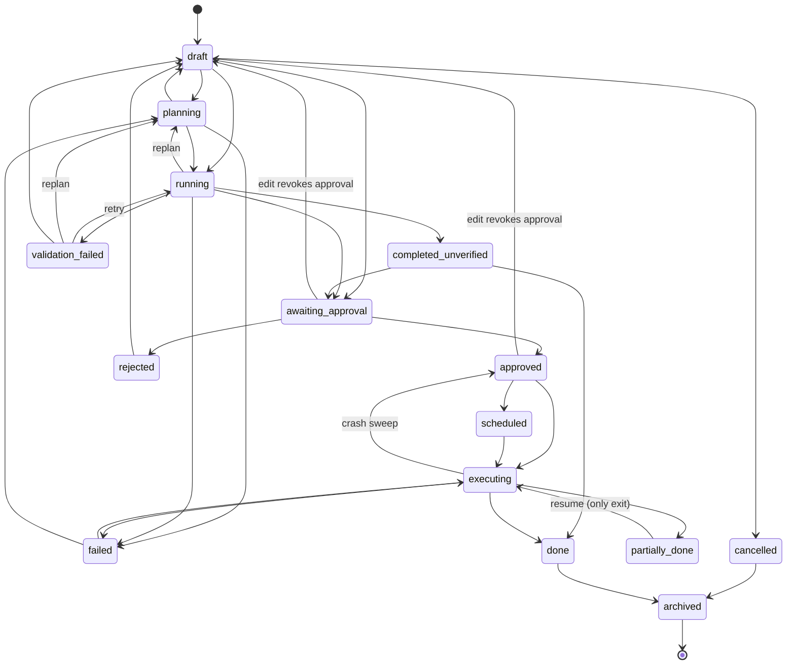

# Architecture diagram (Mermaid)

```mermaid
flowchart TB
  subgraph Entry["Entry points"]
    API["FastAPI /api\ncorrelation → auth(RBAC) → audit middleware"]
    CHAN["Approval channel\n(Telegram long-poll / API)"]
    EVT["Events\nPOST /api/events · autopilot probes"]
    CRON["Scheduler worker\n(due ScheduledTask rows)"]
  end

  subgraph Orchestrator["orchestrator/"]
    SVC["service.py\ncreate / delegate / approve / reject"]
    RTR["router/\nrules → LLM → fallback\nconfidence + needs_human"]
    LIFE["lifecycle.run_cycle\nTASK → EXECUTION → RESULT → EVALUATION\n→ PASS/FAIL → RETRY / REPLAN / ESCALATE"]
    DIR["graph.Director\ngated AgentNodes, dependency order,\nlive-context gates, decisions recorded"]
    DAG["dag.run_plan\nresumable ExecutionPlan/Step\nblocks on 'uncertain'"]
    OPS["operations\nidempotency key · sent BEFORE call\ndone / reconcile / execute"]
    ERR["errors.classify\ntransient→retry · uncertain→reconcile\nvalidation→replan · policy→escalate"]
    STM["states\nTaskState / ExecutionState\n4 invariants verified at import"]
  end

  subgraph Agents["agents/ + llm/"]
    ROSTER["AgentSpec registry\nplanner · researcher · executor · reviewer\nrepairer · judge · distiller · assistant · router"]
    RUN["runtime.run_agent\nprompt(+learned rules +context digest)\n→ provider → JSON validate (1 corrective retry)\n→ tool loop (bounded) → fallback"]
    PROV["providers\ncli (the reviewing agent/codex) · ollama · openai · template\nclassified retries · telemetry · strict mode"]
  end

  subgraph Eval["evaluators/"]
    DET["deterministic checks\nnot_empty · schema · length · banned/required\ngrounded_facts · exit_code · expected_state"]
    JUDGE["LLM judge (optional, cached)\nadjusts, never overrides a hard error"]
    GATE["gate_and_repair\nregenerate with corrective note,\nadopt only strictly-better"]
    EVR["eval runner\nweighted scorer suites · cap on 'grounded'\nEvalRun/EvalResult over time"]
  end

  subgraph Tools["tools/ + security/"]
    CALL["calling.call_tool\n1 permission · 2 schema · 3 DRY-RUN\n4 LIVE GATE · 5 POLICY · 6 APPROVAL\n7 IDEMPOTENCY · 8 call+timeout · 9 audit"]
    REG["tool registry\nToolSpec: schema, permission, risk,\nside_effect, capabilities()"]
    SBX["sandbox\nallowlist · dangerous-pattern refusal\nown process group · timeout · dry-run"]
    POL["policy engine\nfrequency cap · payload · risk tier"]
    APR["approvals\nActionProposal → ApprovalRequest\nconsent ≠ execution"]
    CONN["connectors\ncapabilities read, not assumed"]
  end

  subgraph Memory["memory/"]
    CTX["context layer (files)\nsummaries → digest in every prompt"]
    VEC["vector memory\nlexical/ollama embeddings · cosine recall · RAG ask"]
    FB["feedback → distill → LearnedRule\n→ injected into prompts"]
    CHAT["chat history"]
    CKPT["checkpoints + recovery\nsent-before-call · last-run pacing\ncursor files · crash sweep"]
  end

  subgraph Obs["observability/"]
    LOG["JSON logs · 3-layer redaction\ncorrelation_id · task_id · agent · tool"]
    MET["metrics registry\nnull ≠ 0 · rates over 0 = null"]
    AUD["audit log\nappend-only, flush guard"]
    TRC["trace: AgentStep\nconfidence + evidence"]
    HLT["health\nprobe depth labelled · unknown ≠ ok"]
  end

  DB[("database/\nTask · TaskRun · AgentStep · ActionProposal\nExecutionOperation/Plan/Step · ScheduledTask\nFeedback · LearnedRule · MemoryItem · AuditEvent\nEvalCase/Run/Result · StoredCredential")]

  API --> SVC --> RTR
  API --> LIFE
  CRON --> LIFE
  EVT -->|triggers.propose| SVC
  CHAN -->|approve / reject| APR
  LIFE --> DIR --> RUN --> PROV
  RUN --> CALL
  DIR --> DAG --> OPS
  CALL --> OPS
  LIFE --> DET --> JUDGE
  LIFE -->|retry| GATE
  LIFE -->|escalate| APR
  CALL --> SBX
  CALL --> POL
  CALL --> APR
  CALL --> REG
  REG --> CONN
  OPS --> ERR
  LIFE --> ERR
  LIFE --> STM
  RUN --> CTX
  RUN --> FB
  RUN --> VEC
  LIFE --> TRC
  CALL --> AUD
  API --> AUD
  LIFE --> MET
  CALL --> MET
  API --> HLT
  Orchestrator --> DB
  Tools --> DB
  Memory --> DB
  Obs --> DB
  CKPT --> DB
```

## Lifecycle state diagram

```mermaid
stateDiagram-v2
  [*] --> draft
  draft --> planning
  draft --> running
  draft --> awaiting_approval
  planning --> running
  planning --> draft
  planning --> failed
  running --> completed_unverified
  running --> validation_failed
  running --> awaiting_approval
  running --> failed
  running --> planning: replan
  completed_unverified --> done
  completed_unverified --> awaiting_approval
  validation_failed --> running: retry
  validation_failed --> planning: replan
  validation_failed --> draft
  awaiting_approval --> approved
  awaiting_approval --> rejected
  awaiting_approval --> draft: edit revokes approval
  rejected --> draft
  approved --> scheduled
  approved --> executing
  approved --> draft: edit revokes approval
  scheduled --> executing
  executing --> done
  executing --> partially_done
  executing --> failed
  executing --> approved: crash sweep
  partially_done --> executing: resume (only exit)
  failed --> executing
  failed --> planning
  draft --> cancelled
  cancelled --> archived
  done --> archived
  archived --> [*]
```
