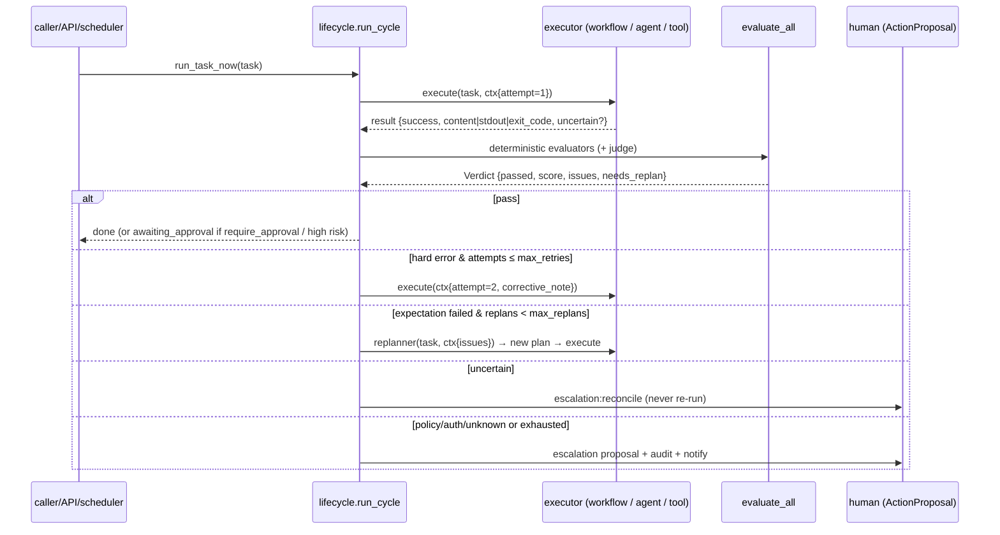

# ORCHESTRATION

How work is routed, executed, retried, escalated and resumed. Original files are cited for every mechanism.

## 1. Main orchestrator

Original: `services/agent/__init__.py::assemble_campaign` (the campaign assembler) driving `orchestration/graph.py::Director` in two phases (reasoning: research/competitor/strategy/memory; production: copy/review/repair), then `services/posting/__init__.py::publish_campaign` after approval.

Core: `orchestrator/service.py` (create/delegate tasks) → `scheduler/queue.run_task_now` (one code path for API, scheduler, triggers and the assistant) → `orchestrator/lifecycle.run_cycle` → `workflows/engine` (Director over nodes) → `tools/calling.call_tool`.

## 2. Workflow engine — the Director graph

Original: `orchestration/graph.py`. Nodes carry `depends_on` and a `gate(ctx) -> (run?, reason)`. `Director.plan` is a dry run; `Director.execute` evaluates gates against the LIVE context, threads each node's output into the shared context, records a `Decision` for every node, and never crashes on a failed node (it is recorded; dependents skip). The campaign Director (`orchestration/campaign.py`) encoded marketing discretion: no product → skip competitor; pinned platforms → skip selection; hard errors → run repair. The pipeline (`orchestration/pipeline.py`) ran the reasoning agents through the same engine, gates = caller flag AND rule.

Core: `orchestrator/graph.py` is the same class with two opt-in additions: `parallel=True` runs nodes at the same dependency depth with `asyncio.gather` (the original is sequential and says so), and an `on_decision` callback. `workflows/spec.py` makes the nodes data (`NodeSpec(agent|tool|fn|evaluators, depends_on, gate)`) and `workflows/engine.py` turns them into `AgentNode`s. The reference workflow `plan_execute_verify` reproduces the campaign graph with the repair node's DYNAMIC gate (`review_found_errors`).

## 3. Agent lifecycle

Original: every agent function (research, strategy, copy, review, distill, chat) = build prompt → `ai.complete` → extract JSON → validate → deterministic fallback → record. Steps are traced to `AutomationLog` (`services/agent/trace.py`) and the spec's `AgentRun`/`AgentStep` rows.

Core: `agents/runtime.run_agent(spec, ctx)`: system prompt = agent prompt + operator instructions + context digest; user prompt = the `reads` keys + brief + corrective note + learned rules; provider call with classified retries; JSON validated against `output_schema` with one corrective retry; a bounded tool-calling loop (`Termination.max_turns / max_tool_calls / stop_when`); fallback when unavailable or unusable; strict mode raises. Every run is traced as an `AgentStep` with confidence/evidence (`observability/trace.py`).

## 4. Task creation, delegation, dependencies

Core `orchestrator/service.py`:
* `create_task(kind, title, brief, input, priority, parent_id, depends_on)` — creates in DRAFT and routes.
* `delegate(parent, …)` — a sub-task an agent hands to another agent; `parent_id` links them.
* `dependencies_met(task)` — a task waits on every id in `depends_on` being `done`; `run_task_now` defers otherwise (`deferred: "dependencies"`).
* `edit_task` applies rule 1 (an edit revokes an approval); `approve_task`/`reject_task` (a stated rejection reason becomes `Feedback`); `cancel_task`.

Original equivalents: `api/campaigns.py` (create/approve/reject/edit), `services/agent/dispatch.py` (approval from a phone), `Campaign.status` transitions.

## 5. Task state transitions

`orchestrator/states.py` — the table from `domain/states.py`, renamed. Rules verified at import:
1. edit to approved → DRAFT (never straight to awaiting_approval; the old prompt could still be answered);
2. cancelled has one exit: archived;
3. no failure state has an edge to succeeded;
4. partially_done's only forward exit is executing.
`advance_task(current, to)` is the only sanctioned way to change a status. `rollup_outcome(total, done, failed, pending, uncertain)` is rule 4 in arithmetic. Legacy aliases (`pending_approval`, `published`, `partial`, `sent`) still parse.

## 6. Retry logic

Original: the `for attempt in range(3)` loops in `services/ai/__init__.py` that `classify()` the error and `break` on a non-retryable class; `scheduling.py` backoff `run_at = now + backoff * attempts` up to `max_attempts`; `review.py::gate_and_repair` (regenerate with the reviewer's issues, adopt only strictly better, bounded rounds).

Core: `orchestrator/retry.with_retry(fn, RetryPolicy)` for calls; `orchestrator/lifecycle` for tasks (`max_retries` with the evaluator's `corrective_note()` in ctx); `scheduler/scheduled.process_due` for scheduled rows (backoff, dead-letter after `max_attempts`); `evaluators/gate.gate_and_repair` for per-item repair.

## 7. Failure handling

`orchestrator/errors.py` — the taxonomy and what each class means:

| class | action | example |
|---|---|---|
| transient | retry | timeout, 429, 503, connection reset |
| auth | reconnect (escalate) | expired token, 401/403 |
| validation | replan | invalid input, command not found |
| policy | escalate | rejected by rule, not allowed |
| capability | disable | not supported / not installed |
| uncertain | reconcile | request sent, response lost (`sent=True, got_response=False`) |
| unknown | escalate | anything else — never looped |

`operations.record()` classifies a tool failure so the durable row itself says whether a retry is safe. `dag.run_plan` blocks on `uncertain`; `dag.reconcile_step(found=True|False)` is the only way out (evidence, not a retry). `memory/recovery.recover_stuck` marks `sent` operations `uncertain` after a crash, never `failed` (which auto-retries) — the original's `_recover_crashed_run`/`recover_stuck_publishing` rule.

## 8. Escalation logic

Every non-pass ends in a human's queue: `lifecycle.run_cycle` creates an `ActionProposal(kind="escalation:<verdict>")` with the result, issues and error class, logs an `AuditEvent`, records `escalations_total`, and calls the handler's `notify` (e.g. a Telegram message). A high-risk tool call creates `ActionProposal(kind="execute_tool")` and returns `requires_approval` with the proposal id; calling again with `approved_proposal_id` executes it (`tools/calling.py`). The router marks tasks whose wording spends/deletes/reaches outside as `needs_human` (`router/rules.HUMAN_WORDS`, from `orchestration/router.py::_HUMAN_WORDS`).

## 9. Parallel vs sequential execution

* Original: the Director is sequential by design ("correct ordering and safe resume are the point, and it keeps every DB write off any concurrent path"). Copy generation across platforms and publish fan-out use `asyncio.gather`, with DB writes done sequentially before and after the gather (`posting/__init__.py`: begin/mark_sent in the build loop, record in the results loop — "never a DB write from inside the concurrent gather").
* Core: `Director.execute(parallel=False)` default; `parallel=True` gathers nodes at one dependency depth using per-node context snapshots merged afterwards; `dag.run_plan` is sequential; `tools/calling` writes its operation row before and after the call on the caller's session — keep tool calls that share a session sequential, or give each its own session.

## 10. Dependencies between tasks and steps

* Node level: `AgentNode.depends_on` / `NodeSpec.depends_on` (skip propagation).
* Step level: `StepSpec.depends_on` inside a plan (a blocked dependency blocks the plan).
* Task level: `Task.depends_on` (JSON ids) checked by `dependencies_met` before a run; `parent_id` for delegation trees.

## 11. Event-driven triggers

Original: `services/triggers.py` (catalogue-change events → at most 2 campaigns per run, 14-day per-product cooldown, 72h max age, never a rise/out-of-stock) and `autopilot/loop.py` (runtime-gated, paced by last run). Core: `scheduler/triggers.py` (`record()` writes an event line; `propose()` applies registered `Trigger`s with a per-run cap, per-subject cooldown and age window) plus `scheduler/builtin.py` workers (`triggers` every 10 min, `autopilot` runtime-gated). `POST /api/events` records an event; `POST /api/events/propose` runs the trigger pass.

## 12. Sequence: TASK → EXECUTION → RESULT → EVALUATION → PASS/FAIL → RETRY/REPLAN/ESCALATE

Tests pinning each branch: `tests/test_lifecycle.py`, `tests/test_graph.py`, `tests/test_operations_dag.py`, `tests/test_states.py`.
